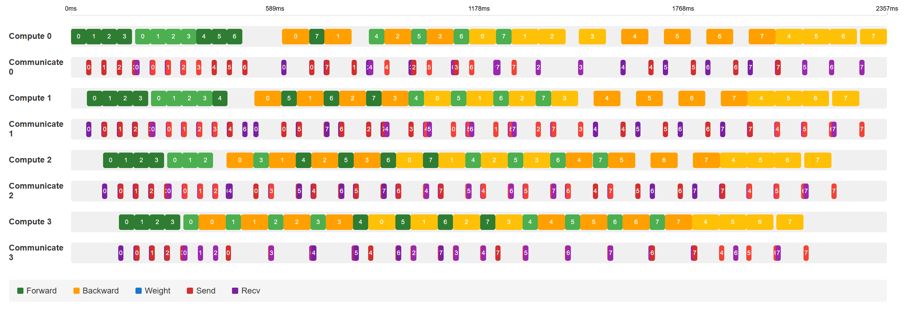

# zeropipe
Experiments with Pipeline Parallelism

## Schedules and Visualization

You can build pipeline parallel schedules from scheduler classes under `zeropipe.schedules` and visualize them with `zeropipe.visualize.visualize_schedule`.

For example, to build a schedule for 4 stage interleaved 1F1B scheduling with 8 microbatches, you can do something like this:

```python
from zeropipe.schedules.interleaved_1f1b import Interleaved1F1BSchedule
from zeropipe.schedules.schedule import ScheduleConfig, finalize_schedule
from zeropipe.visualize import visualize_schedule

# Some statistics for the model forward, backward, and weight gradients
f_mid = 44.180
b_mid = 40.265
w_mid = 38.0
c = 2.17
n_stages = 4
n_microbatches = 8
hidden_size = 4096
n_heads = 8
seq_len = 4096
f_mem = 34 * hidden_size + 5 * n_heads * seq_len
w_mem = -32 * hidden_size
b_mem = -f_mem - w_mem


config = ScheduleConfig([f_mid] * n_stages, [b_mid] * n_stages, [w_mid] * n_stages,
                        cost_comm=c,
                        n_stages=n_stages, n_microbatches=n_microbatches,
                        max_chunks=2, mem_forward=[f_mem] * n_stages,
                        mem_backward=[b_mem] * n_stages,
                        mem_weight=[w_mem] * n_stages)

schedule = Interleaved1F1BSchedule(config)
# Build the schedule that consists of forward, backward, and weight gradient operations
schedule, _ = schedule.build_schedule()
# Finalize the schedule by adding communication operations
schedule_comm = finalize_schedule(config, schedule)

visualize_schedule("pp-schedule-interleaved.html", schedule_comm)
```

Then you can open `pp-schedule-interleaved.html` in your browser to see the schedule.

